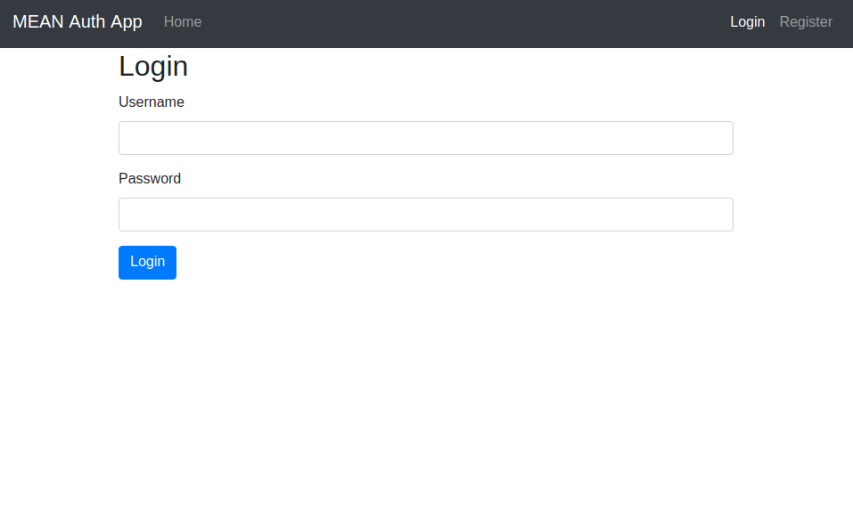

# meanapp
Below are some screenshots of what the web app looks like on the different pages.

It is quite a simple project at the moment, however this is going to be used in future projects of mine. Building upon this while learning new things.

# HOME

# REGISTER

# LOGIN

# PROFILE

# DASHBOARD

